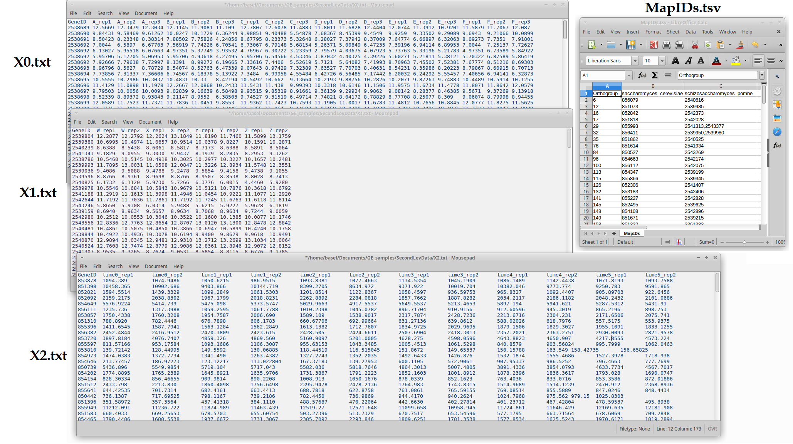

# Bi-CoPaM
The Bi-CoPaM identifies clusters (groups) of objects which are well-correlated with each other across a number of given datasets with minimal need for manual intervention.

*Figure 1: The Bi-CoPaM generates clusters (C0, C1, C2, ...) out of an input of 9,462 objects based on their profiles in three datasets (X0, X1, and X2). The left-hand panel shows the profiles of all 9,462 objects in each one of the three datasets, while the right-hand panel shows the profiles of the objects within each one of the clusters. The objects included in any given cluster are well-correlated with each other in each one of the three datasets. Note that the number of conditions or time points are different amongst the datasets.*

**Features!**

1. No need to filter your data before submission.
2. No need to preset the number of clusters; the algorithm finds it automatically.
3. The algorithm automatically filters out any objects that do not fit into any cluster.
4. You can control the tightness of the clusters simply by varying a parameter, which has a default value if you wish not to set it!
5. You can include heterogeneous datasets (e.g. gene expression datasets from different technologies, different species, different numbers of conditions, etc). Have a look at the **Simple usage** section.
5. The package calculates key statistics and provides them in the output.
6. A table of clusters' members is provided in an output TSV file.
7. A figure showing the profiles of the generated clusters is provided as an output PDF file.

## Automatic Bi-CoPaM analysis pipeline

*Figure 2: Automatic Bi-CoPaM analysis pipeline*

## Simplest usage
- `bicopam data_path`

This applies the Bi-CoPaM pipeline over the datasets with files included in the data_path directory with default parameters.

#### Data files
Each dataset is represented in a single TAB delimited (TSV) file in which the first column represents the identifiers
(IDs) of the objects (e.g. gene names), the first row represents unique labels of the samples (e.g. conditions or time
points), and the rest of the file includes numerical values of these objects at those samples. Figure 3 shows a screen 
shot of the first few lines of 3 datasets' files.

*Figure 3: Snapshots of three data files X0, X1, and X2.*

* When the same object ID appears in different datasets, it is considered to refer to the same object. For example, the
object ID O01 in the dataset X0 is considered to refer to the same object as O01 in the datasets X1 and X2.
* If more than one row in the same file had the same identifier, they are automatically summarised by summing up their values.

## 2nd level usage (replicates, normalisation, and ID maps (e.g. orthologues))
- `bicopam data_path  -r replicates_file -n normalisation_file -m map_file`

*Figure 4: Snapshots of three gene expression datasets from two yeast species, X0 and X1 from fission yeast
(Schizosaccharomyces pombe) and X2 from budding yeast (Saccharomyces cerevisiae).
A TAB delimited file is provided to map fission and budding yeast genes, i.e. to identify orthologues across
the two species.*

#### Replicates file

#### Normalisation file

#### Map file

## Advanced usage

