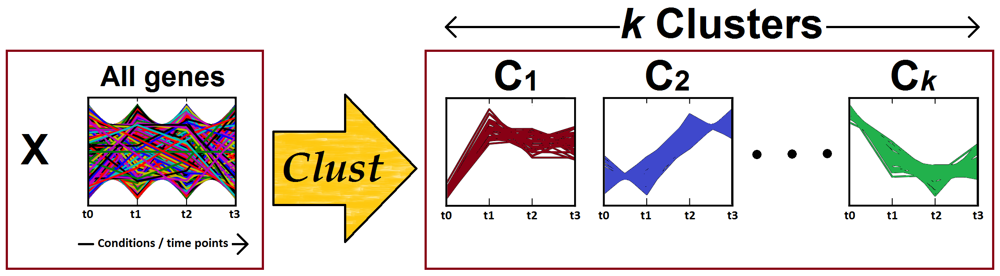
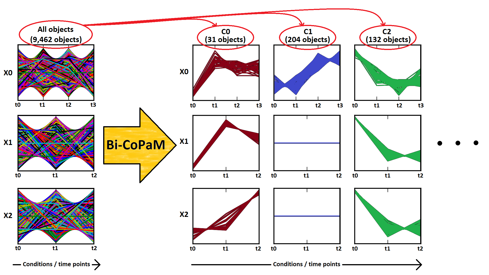
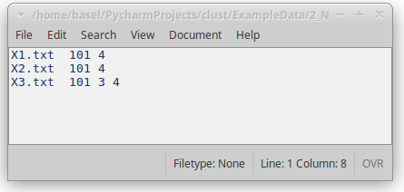
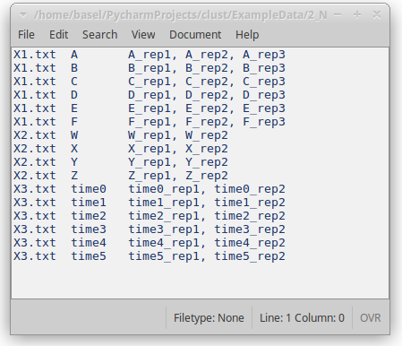
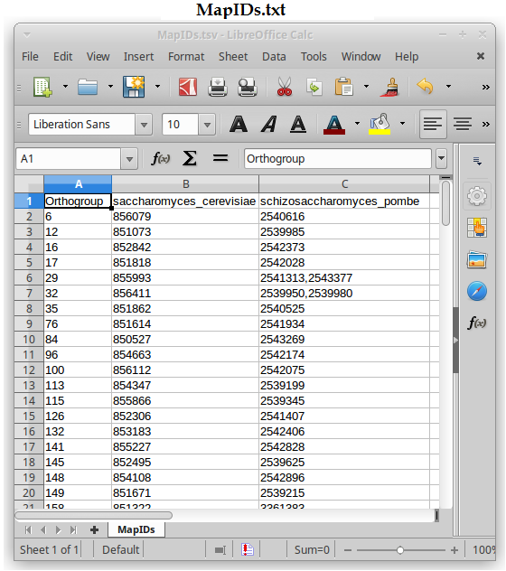
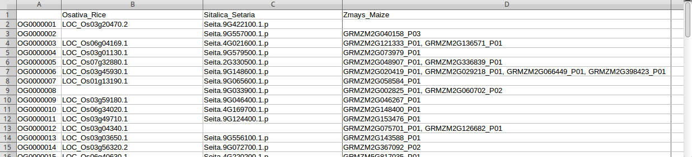

# Clust
Optimised consensus clustering of one or more heterogeneous datasets
### Contents
* [What does *Clust* do?](#what-does-clust-do)
* [How does *Clust* do it?](#how-does-clust-do-it)
* [Install *Clust*](#install-clust)
* [Run *Clust*](#run-clust)
* [Normalisation](#normalisation)
* [Handling replicates](#handling-replicates)
* [Data from multiple species](#data-from-multiple-species)
* [Data from multiple technologies (e.g. mixing RNA-seq and microarrays)](#data-from-multiple-technologies-eg-mixing-rna-seq-and-microarrays)
* [Handling missing genes](#handling-missing-genes)
* [Handling genes with low expression](#handling-genes-with-low-expression)
* [Are you obtaining noisy clusters?](#are-you-obtaining-noisy-clusters)
* [List of all parameters](#list-of-all-parameters)
* [Example datasets](#example-datasets)
* [Citation](#citation)

# What does Clust do?
*Clust* is a fully automated method for identification of clusters (groups) of genes that are consistently
co-expressed (well-correlated) in one or more heterogeneous datasets from one or multiple species.

#### The single dataset case:

*Figure 1: Clust processes one gene expression dataset to identify (*K*) clusters of co-expressed genes. Clust
automatically identifies the number of clusters (*K*).* 

#### The multiple datasets case:

*Figure 2: Clust processes multiple gene expression datasets (X1, X2, ... X(*L*)) to identify clusters of genes
that are co-expressed (well-correlated) in each of the input datasets. The left-hand panel shows the gene expression
profiles of all genes in each one of the input datasets, while the right-hand panel shows the gene expression profiles 
of the genes in the clusters (C1, C2, ... C(*k*)). Note that the number of conditions or time points are different for
each dataset.*

### Features!

1. No need to pre-process your data; *clust* automatically normalises the data.
2. No need to preset the number of clusters; *clust* finds this number automatically.
3. You can control the tightness of the clusters by varying a single parameter `-t`
4. It is okay if the datasets:
   * Were generated by different technologies (e.g. RNA-seq or microarrays)
   * Are from different species
   * Have different numbers of conditions or time points
   * Have multiple replicates for the same condition
   * Require different types of normalisation
   * Were generated in different years and laboratories
   * Have some missing values
   * Do not include every single gene in every single dataset

5. *Clust* generates the following output files:
   * A table of clustering statistics
   * A table listing genes included in each cluster
   * Pre-processed (normalised, summarised, and filtered) datasets' files
   * Plotted gene expression profiles of clusters (a PDF file)

# How does Clust do it?

*Figure 3: Automatic Clust analysis pipeline*

# Install *Clust*

### Required Python packages

*Clust* is a Python package, which requires Python 2.7 or newer and depends on these Python packages:
* numpy
* scipy
* matplotlib
* sklearn
* sompy
* joblib
* portalocker

You can check if you have these packages by:

* `pip freeze`

### Install using sudo privileges

Use this, for example, to install *clust* on a server for all users.

If `matplotlib` is not already installed, install it:

* `sudo apt-get install python-matplotlib`

Then install *clust* by:

* `sudo pip install clust`

Then you can run *clust* straightforwardly from any place:

* `clust ...`

If you already have *clust* and want to update it, try:

* `sudo pip uninstall clust`
* `sudo pip install clust --no-cache-dir`

### Install without sudo privileges (Way 1)

This installs *clust* for the local user only:

* `pip install --user clust`

If you already have *clust* and want to update it, try:

* `pip install --user clust --upgrade`

Then you can run *clust* by:

* `clust ...`

### Install without sudo privileges (Way 2)

This works if the Python packages that *clust* requires are already installed (listed above).

Download the latest release file (clust-*.*.*.tar.gz) file from the
[release tab](https://github.com/BaselAbujamous/clust/releases)
and run the script `clust.py` that is in the top level directory of the source code by:

* `python clust.py ...`

### For Windows users

Clust has not been tried in Windows thoroughly. If you try it, your feedback will be much appreciated.

We recommend that you download and install WinPython which provides
you with many Python packages that *clust* requires from http://winpython.github.io/

Open `WinPython Powershell Prompt.exe` from the directory in which you installed WinPython.

Run:

* `pip install clust`

Then you can run *clust* by:

* `clust ...`

# Run *Clust*
For normalised homogeneous datasets, simply run:

- `clust data_path`
- `clust data_path -o output_directory [...]`

This runs *clust* over the datasets in the data_path directory with default parameters.
If the output directory is not provided, *clust* creates a new directory for the results within the
current working directory.

For raw RNA-seq TPM, FPKM, or RPKM data, consider the [Normalisation](#normalisation) section below.
Other sections below address handling [replicates](#handling-replicates), handling data from 
[mulitple species](#data-from-multiple-species), and handling
[microarray data](#data-from-multiple-technologies-eg-microarrays) (only or mixed with RNA-seq data).

### Data files format
Each dataset is represented in a single TAB delimited (TSV) file in which the first column represents gene IDs,
the first row represents unique labels of the samples, and the rest of the file includes numerical values, mainly
gene expression values.

*Figure 4: Snapshots of the first few lines of three data files X1.txt, X2.txt, and X3.txt.*

* When the same gene ID appears in different datasets, it is considered to refer to the same gene.
* If more than one row in the same file had the same identifier, they are automatically summarised by
summing up their values.
* **IMPORTANT**: Gene names should not include spaces, commas, or semicolons.

# Normalisation
**NEW FEATURE: AUTOMATIC NORMALISATION! (V1.7.0 and newer)**

*Clust* applies data normalisation during its pre-processing step.

* Version 1.7.0 and newer: *Clust* **automatically detects** the most suitable normalisation for each dataset unless 
otherwise stated by the user via the `-n` option. The normalisation codes that *clust* decides to
apply are stored in the output file `/Normalisation_actual`

* Version 1.6.0 and earlier: The required normalisation techniques should be stated by the user via the `-n` option.
Otherwise, no normalisation is applied. 

#### The `-n` option:
Tell *clust* how to normalise your data in one of two ways:

1. `clust data_path -n code1 [code2 code3 ...] [...]` **(V1.7.0 and newer)**

    * List one or more normalisation codes (from the table below) to be applied to your one or more datasets
    * Example: `clust data_path -n 101 3 4 [...]`
    
2. `clust data_path -n normalisation_file [...]`

    * Provide a file listing the normalisation codes for each dataset (see Fig. 5).
    * Each line of the file includes these elements in order:
        1. The name of the dataset file (e.g. X0.txt)
        2. One or more normalisation codes. **The order** of these codes defines the order of the
application of normalisation techniques.
    * Delimiters between these elements can be spaces, TABs, commas, or semicolons.

*Figure 5: Normalisation file indicating the types of normalisation that should be applied to each of the datasets.*

#### Codes suggested for commonly used datasets

* RNA-seq TPM, FPKM, and RPKM data: **101 3 4**
* Log2 RNA-seq TPM, FPKM, and RPKM data: **101 4**
* One-colour microarray gene expression data: **101 3 4**
* Log2 one-colour microarray gene expression data: **101 4**
* Two-colour microarray gene expression data: **3 6**
* Log2 two-colour microarray gene expression data: **6**

#### All normalisation codes

Code | Definition
|:---:|:---|
0|No normalisation (Default in v1.6.0 and earlier)
1|Divide by the mean value of the row
2|Divide by the first value of the row
3|Log2
31|Set all values that are less than 1.0 to 1.0, then log2 (v1.7.0+)
4|Subtract the mean of the row and then divide by its standard deviation
5|Divide by the total (sum) of the row
6|Subtract the mean value of the row
7|Divide by the maximum value of the row
8|2 to the power X
9|Subtract the minimum value of the row
10|Rank across rows (1 for the lowest, up to *N* for *N* columns; average ranks at ties)
11|Rank across rows (1 for the lowest, up to *N* for *N* columns; order arbitrarly at ties)
12|Linear transformation to the [0, 1] range across rows (0.0 for the lowest and 1.0 for the highest)
13|Set all values of genes with low expression everywhere to zeros. The threshold of low expression is found by fitting a bimodal distribution to per-gene maximum expression values over all samples (v1.7.0+)  
-|-
101|Quantile normalisation
102|Column-wise mean subtraction
103|Subtract the global mean of the entire dataset
-|-
1000|Automatic detection of suitable normalisation (Default in v1.7.0 and newer)

# Handling replicates
If multiple replicates exist for the same condition, include this information in a `replicates file` and provide it
to `clust` by:

* `clust data_path -r replicates_file [...]`

Each line in the replicates file relates to the replicates of a single condition or time point,
and includes these elements in order:

1. The name of the dataset file (e.g. X0.txt).
2. A name for the condition of time-point; this can be any label that the user chooses.
3. One or more names of the replicates of this condition. These should match column names in the dataset file.

*Figure 6: Replicates file*

* Delimiters between these elements can be spaces, TABs, commas, or semicolons.

# Data from multiple species
If your datasets come from multiple species, you can include a `mapping file` that defines gene mapping across species.

* `clust data_path -m map_file [...]`

The mapping file is a TAB delimited file in which the first row shows the names of the species and the first column
shows the IDs of the orthologue groups (OGs). Each OG includes zero, one, or many orthologous genes in each species'
column split by commas.

*Figure 7: Mapping fission and budding yeast genes*

*Figure 8: Mapping rice, setaria, and maize genes. Notice that some OGs do not include genes in some species*

* You can use [Orthofinder](#) to identify the OGs across multiple species. Orthofiner's output file `Orthogroups.csv`
can be provided directly to `clust` as the mapping file.

* If some genes do not exist in some species (e.g. Figure 8), have a look at the section [Genes missing from some
datasets](#genes-missing-from-some-datasets) below.

# Data from multiple technologies (e.g. mixing RNA-seq and microarrays)

Incorporating microarray data in the analysis with or without RNA-seq data can be straightforwardly done.
The main point to be taken care of is to include the correct normalisation codes for the different datasets
as detailed in the [Normalisation](#normalisation) section above.

Also, if the first column of the microarray data file includes probe IDs which are not identical across datasets
generated by using different microarray/RNA-seq platforms, make sure that probe-gene mapping information is included in
the map file described [above](#data-from-multiple-species).

For example, you may apply *clust* to tens of human and mouse datasets generated by
these different technologies / platforms:

Platform / Format | Technology | Example identifier
:---|:---|:---
|Human RNA-seq reads (TPM) | RNA-seq | NM_000014.4
|Mouse RNA-seq reads (TPM)| RNA-seq | NM_001166382.1
|Affymetrix Human Genome U133+ 2.0 | Microarray | 1552258_at
|Illumina Human WG-6 v3.0 |Microarray | ILMN_1825594
|Illumina Mouse WG-6 v2.0 |Microarray | ILMN_1243094

In this case, provide *clust* with a mapping file (TAB delimited) which looks like this:

OG | H_RNAseq | M_RNAseq | H_U133+ | H_WG6 | M_WG6
:---|:---|:---|:---|:---|:---|
OG00001| NM_001105537.2 | NM_001310668.1, NM_001310668.1 | 204474_at, 37586_at | ILMN_1676745 | ILMN_1236966
...|...|...|...|...|...|

Here, the probes/transcripts that represent the human gene ZNF142 or its mouse orthologue Znf142 from the five
platforms are mapped to a single unique OrthoGroup (OG) identifier (OG00001).

This mapping file is provided to `clust` by the `-m` option:

* `clust data_path -m map_file [...]`

# Handling missing genes

These are many reasons that result in missing some genes from some datasets:

* Datasets are from multiple species and some genes do not exist in some species (see Figure 8 above for example)
* Older platforms of microarrays did not include probes for some genes
* Other reasons

*Clust* allows you to automatically discard genes that do not appear in all (or most) datasets by
 using the `-d` option. This option specifies the minimum number of datasets in which a gene has to be present
 for it to be included in the analysis.
 
For example, if you have 20 datasets, you can force *clust* to discard any gene that is not included at least
in 17 datasets by:

* `clust data_path -d 17 [...]`

# Handling genes with low expression

By default in v1.7.0+, *Clust* filters out genes with flat expression
profiles (profiles with absolutely no change in expression) after
summarising replicates and normalisation. To switch this option off,
use the `--no-fil-flat` option.

Also, *clust* can automatically filter out genes with low expression values if you provide the three options
`-fil-v`, `-fil-c`, and `-fil-d` to *clust*:

* `clust data_path -fil-v value  -fil-c conditions -fil-d datasets`

This will discard any gene that does not have at least the value of `value`,
at least at `conditions` conditions, at least in `datasets`. This is applied before normalisation
but after summarising replicates and handling gene mapping across multiple species.

# Are you obtaining noisy clusters?
A tightness parameter `-t` controls how tight the clusters should be
(tighter and smaller clusters versus less tight and larger clusters).
This is a real positive number with the default value of **1.0**. Values smaller than 1.0 (e.g. 0.5) produce less
tight clusters, while values larger than 1.0 (e.g. 2.0, 5.0, 10.0, ...) produce tighter clusters.

Try larger values of `-t` to obtain tighter clusters:

* `clust data_path -t tightness_level`

# List of all parameters
Parameter | Definition
--- | ---
data_directory | The path of the directory including all data files
-|-
-n \<file or integer list> | Path of the normalisation file or a list of normalisation codes. See the [Normalisation section](#normalisation) above for details.
-r \<file> | Path of the replicates file
-m \<file> | Path to orthogroup mapping file
-o \<directory> | Custom path of the output directory
-|-
-t \<real number> | (Cluster tightness) versus (cluster size) weight: a real positive number, where 1.0 means equal weights, values smaller than 1.0 means larger and less tight clusters, and values larger than 1.0 produce smaller and tighter clusters (default: 1.0).
-q3s \<real number> |  Defines the threshold for outliers in terms of the number of Q3's (third quartiles). Smaller values lead to tighter clusters (default: 2.0).
-|-
-fil-v \<real number> | Threshold of data values (e.g. gene expression). Any value lower than this will be set to 0.0. If a gene never exceeds this value at least in FILC conditions in at least FILD datasets, it is excluded from the analysis (default: -inf)
-fil-c \<integer> | Minimum number of conditions in a dataset in which a gene should exceed the data value FILV at least in FILD datasets to be included in the analysis (default: 0)
-fil-d \<integer> | Minimum number of datasets in which a gene should exceed the data value FILV at least in FILC conditions to be included in the analysis (default: 0)
--fil-abs | -fil-v is used as a threshold for the absolute values of expression. Useful when the data has positive and negative values (e.g. log-ratio 2-colour microarray data). (default: not used).
--fil-perc | -fil-v is a percentile of gene expression rather than an absolute expression value (e.g. -fil-v 25 sets the 25th percentile of all gene expression values as the threshold). (default: not used).
--fil-flat | Filter out genes with flat expression profiles (constant expression over all samples in all datasets). (default: used).
--no-fil-flat | Cancels the default --fil-flat option.
-|-
-d \<integer> | Minimum number of datasets in which a gene has to be included for it to be considered in the *clust* analysis. If a gene is included only in fewer datasets than this, it will be excluded from the analysis (default: 1)
-cs \<integer> | Smallest cluster size (default: 11)
-K \<integer> [\<integer> ...] | K values: refer to the publication for details (default: all even integers from 4 to 20 inclusively)
-|-
--no-optimisation | Skip the cluster optimisation step. Not recommended except to compare results before and after optimisation (default: optimisation is performed).
-basemethods \<string> [\<string> ...] | One or more base clustering methods (default (V1.8.0+): k-means)
-|-
-np \<integer> | Number of parallel processes (default: 1) 
-h, --help | show the help message and exit

# Example datasets

### Raw expression data from multiple species

Example datasets are available in [ExampleData/1_RawData](ExampleData/1_RawData). These
are three datasets from two yeast species, two datasets from fission yeast, and one from budding
yeast.

That directory contains the datasets' files in a [Data](ExampleData/1_RawData/Data) sub-directory,
and includes three other files specifying the [replicates](ExampleData/1_RawData/Replicates.txt),
the required [normalisation](ExampleData/1_RawData/Normalisation.txt), and the gene
[mapping](ExampleData/1_RawData/MapIDs.txt) across the datasets,
i.e. orthologous genes across the two yeast species.

Run *clust* over this data by:

* `clust Data/ -r Replicates.txt -n Normalisation.txt -m MapIDs.txt`

Or let *clust* automatically detect suitable normalisation by running (v1.7.0+):

*  `clust Data/ -r Replicates.txt -m MapIDs.txt`

You may like to specify a tightness level `-t` other than the default by adding:

* `... -t 5`

You may also specify an output directory other than the default by adding:

* `... -o MyResultsDirectory/`

### Pre-processed data

Example datasets of datasets taken from one species, have no replicates, and already normalised are available in
[ExampleData/2_Preprocessed](ExampleData/2_Preprocessed), or more specifically in the
[Data](ExampleData/2_Preprocessed/Data) directory therein. These datasets require no pre-processing, so you can
simply run this command over the directory "Data":

* `clust Data/`

Find the results in the Results_[Date] directory that *clust*
will have generated in your current working directory.

This runs *clust* with the default tightness `-t` value of 1.0.
You may like to make the generated clusters tighter by increase `-t` or less tight
by decreasing `-t`. For example, try -t = 5.0 or -t = 0.2 by: 

* `clust Data/ -t 5`
* `clust Data/ -t 0.2`

You may also like to save results in an output directory of your choice by using `-o`:

* `clust Data/ -t 5 -o MyResultsDirectory/`

# Citation
When publishing work that uses *clust*, please cite this pre-print:
1. Basel Abu-Jamous and Steven Kelly (2018) Clust: automatic extraction of optimal co-expressed gene clusters from gene expression data. `bioRxiv` 221309; doi: https://doi.org/10.1101/221309.
